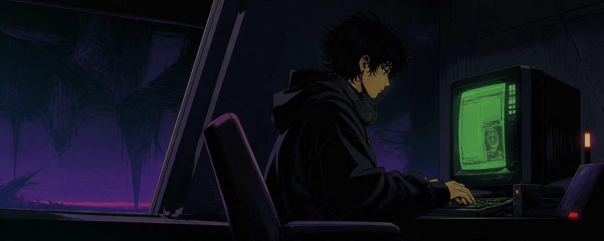

<p align="center">
  
</p>

<div align="center">

# ZAWTT `//` DEV TERMINAL

### `HOBBY DEVELOPER · GAME SYSTEMS · REVERSE ENGINEERING`


</div>

## `PROFILE // 01`

<table>
  <tr>
    <td width="34%" align="center">
      
    </td>
    <td width="66%" valign="top">
      <h3>Curiosity, compiled.</h3>
      <p>
        I'm a hobby developer who learns by building things, taking systems
        apart, and putting them back together differently. Most of my projects
        live somewhere between games, desktop tools, automation, and
        reverse-engineering experiments.
      </p>
      <p>
        I care about understanding what happens beneath the interface: how an
        engine moves things, how a format stores data, and how one oddly
        specific idea becomes a polished little tool.
      </p>
      <p><code>STATUS</code> Building for curiosity first.</p>
      <p><code>RULE</code> Experiments should be safe, reversible, and documented.</p>
      <p><code>RESULT</code> Occasionally useful. Consistently fun.</p>
    </td>
  </tr>
</table>

## `PROJECT ARCHIVE // 02`

<p align="center">
  <a href="https://github.com/Zawtt/RO-HowToFish-Roulette-Operator">
    
  </a>
  <a href="https://github.com/Zawtt/Rhythia-0.1.2-RHM-Backport">
    
  </a>
  <a href="https://github.com/Zawtt/MoonCycle">
    
  </a>
  <a href="https://github.com/Zawtt/rpg-dice-app">
    
  </a>
</p>

## `TOOLCHAIN // 03`

<div align="center">
  
  <br><br>
  <code>C#</code> · <code>.NET</code> · <code>Python</code> · <code>JavaScript</code> · <code>Lua / Luau</code><br>
  <code>Godot</code> · <code>Unity</code> · <code>Git</code> · <code>GitHub</code> · <code>VS Code</code>
</div>

## `CURRENT DIRECTIVES // 04`

```text
[01] Explore unusual game mechanics and engine internals.
[02] Build focused tools for very specific problems.
[03] Learn from open-source code instead of treating it like a black box.
[04] Keep experiments reversible, readable, and a little bit weird.
```

## `TELEMETRY // 05`

<div align="center">
  
  
</div>

---

<div align="center">
  
  <br><br>
  <sub><code>Learning by building. Breaking things carefully. Fixing them better.</code></sub>
</div>
