  

  # hi
   

 i luv pretending i know what im doing

## project archive

  
  

## things i use

  

## activity

  
  

<picture>
  <source media="(prefers-color-scheme: dark)" srcset="https://raw.githubusercontent.com/Zawtt/Zawtt/output/github-contribution-grid-snake-dark.svg" />
  <source media="(prefers-color-scheme: light)" srcset="https://raw.githubusercontent.com/Zawtt/Zawtt/output/github-contribution-grid-snake.svg" />
  
</picture>

---

  build something weird. learn something useful.

